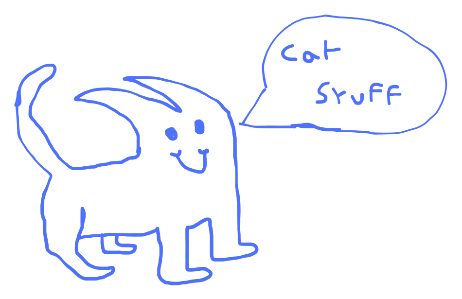

# [Chat](https://jsr.io/@loading/chat)



## Simply run the following command and thats it

```sh
deno run -A jsr:@loading/chat
```

## create a `chat-config.toml` file in the active directory to configure the chat

```toml
[config]
model = "onnx-community/Llama-3.2-1B-Instruct"
system = [
  "You are an expert in computer science and programming.",
  "Provide detailed explanations and code examples when necessary."
]
max_new_tokens = 128
max_length = 20
temperature = 1.0
top_p = 1.0
repetition_penalty = 1.2
```

## Run the server to kinda match a similar api to the openai chat api

```sh
deno serve -A jsr:@loading/chat/server
```

### Try it out

```sh
curl -X POST http://localhost:8000/v1/completions \  -H "Content-Type: application/json" \  -d '{    "prompt": "Once upon a time",    "max_tokens": 50,    "temperature": 0.7  }'
```

## License

This project is licensed under the MIT License - see the [LICENSE](LICENSE) file
for details.
